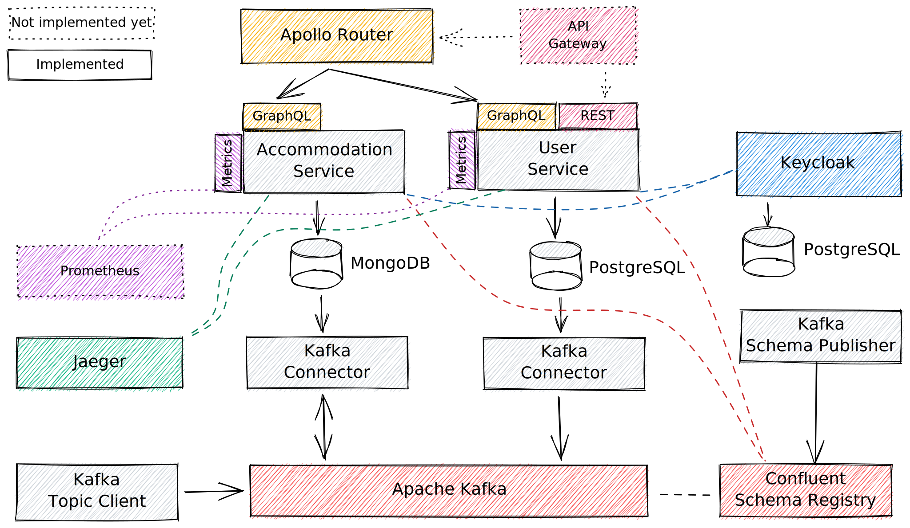

# Rust microservices demo application

This repo contains a demo application written in rust, showcasing the use of
commonly used enterprise application technologies.

- Messaging with Apache Kafka (Apache Avro message format)
- Interaction with databases (including transactions)
  - Relational databases (PostgreSQL)
  - NoSQL databases (MongoDB)
- Tracing with Jaeger
- Prometheus metrics endpoints
- API technologies
  - REST
  - GraphQL (including federation with apollo-router)
- OAuth 2.0 authentication with Keycloak

The application is a proof-of-concept and contains a few
conceptual simplifications:

- Messaging
  - Dual write mechanism was not tested to work correctly under load
    (especially the mongodb version needs to be checked as the solution
     relies on the ordering properties of the document's ObjectId)
  - Event handling in consumers need a few more rounds of abstraction
    and generalization.
- Testing
  - The code was not written with testing in mind. A few more abstraction
    would potentially be needed to make the code better testable.
- Security
  - The authentication mechanism is not security/pen-tested and was not
    audited.
  - Authorization functionality is missing.
  - SeaOrm related code is not tested regarding SQL Injection sensitivity 
    (not checked whether the code uses prepared statements).
  - Keycloak configuration is only appropriate for local testing

## Architecture


## Project structure
The code is structured into five parts: Apps (services), Common (shared 
libraries), Docker (related configuration file), Kafka-Schema definitions and
Scripts.

### Apps
The project consists of four primary services:
- app-accommodation-service
- app-kafka-connector-mongodb
- app-kafka-connector-relational
- app-user-service

Additionally two supporting service exist, that must be executed initially 
after starting the docker containers:
- app-kafka-schema-publisher
- app-kafka-topic-client

### Common
Common, reusable aspects are extracted into libraries:
- common-db-mongodb
- common-db-relationaldb
- common-error
- common-kafka
- common-metrics
- common-security
- common-tracing

### Docker
Docker related files can be found in the directory `docker`.
There are convenience scripts in the `scripts` directory
and run-configurations for IntelliJ, that can be used.

### Kafka-Schema
The kafka message schemas are specified by using the Apache Avro
message format. The schemas can be found in the modules:
- kafka-schema-accommodation
- kafka-schema-common
- kafka-schema-user

### Scripts
Convenience scripts to start the docker-compose file and the
apollo router can be found in the `scripts` directory.

## Running the application

### Start supporting services with docker-compose
Apache Kafka, Jaeger, the Databases and Keycloak are preconfigured in `docker/docker-compose.yml`.

The containers can be started/stopped using the convenience scripts:
- `scripts/docker-comppse-up.sh` and 
- `scripts/docker-compose-down.sh`.

The apollo-router for graphql federation can be started using the scripts:
- `scripts/apollo_router_download.sh` to download the repo (as there are no pre-build binaries for apple silicon)
- `scripts/apollo_router_build.sh` to build the router
- `scripts/apollo_router_run.sh` to run the router

### Starting the applications
The applications can be started by setting the active profiles as an 
environment variable `RUST_PROFILES_ACTIVE=LOCAL`.

There are also pre-configured IntelliJ run configurations that can be used to start the
services in debug or release mode in IntelliJ.

## Development
The source code is developed with rust's stable toolchain. 

### Format
The code is formatted using nightly features.
The format specification can be found in `rustfmt.toml`.

The code can be formatted on command line with the command:
```shell
cargo +nightly fmt
```

In IntelliJ the formatter can be configured by opening:
`Preferences > Languages & Frameworks > Rust > Rustfmt` 
and selecting the channel `nightly`.

## License

The code of the demo application in this repo is licensed under the:
* [MIT license](LICENSE-MIT)

The module `opentelemetry-propagator-b3` contains copied and modified code
of the crate [opentelemetry-zipkin](https://github.com/open-telemetry/opentelemetry-rust/tree/main/opentelemetry-zipkin)
which is licensed under the [Apache 2.0 License](https://github.com/open-telemetry/opentelemetry-rust/blob/main/opentelemetry-zipkin/LICENSE)